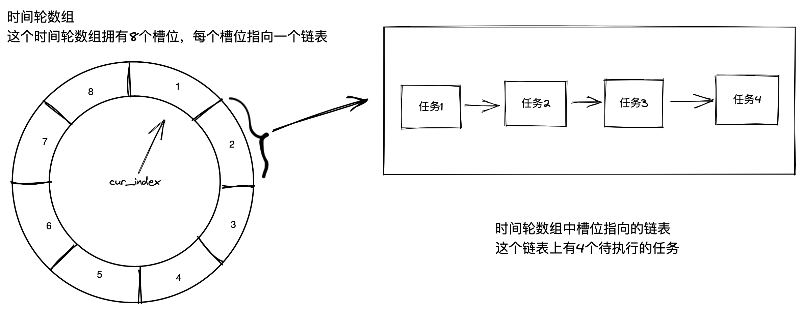

[TOC]

# 时间轮
用于任务的调度，解决任务量大时进行任务的维护消耗资源的问题。

## 场景
想象这么一个场景，我需要维护一个连接池，连接池中的连接是有超时时间的，连接会保持一定频率发送心跳包比如5s发一次，30s内如果没有收到keep-alive就会过期，到过期时间的conn断开连接，如何去设计这个连接池？

## 场景抽象
这个场景可以理解为，我收到一个请求之后，在延迟30秒后需要执行一个动作，并且如果在30s内收到同样的请求，就把这个任务再推迟30s，我们应该怎么做呢？

## 可行解
那假设我的连接池最大连接数是1000，简单的方法是每个连接维护一个最近的keep-alive时间，启动一个定时器，每秒去遍历一次所有连接，到时间了就断开连接。收到心跳时，更新这个连接的时间，那如果有10000个连接呢？每秒就要遍历10000次才能确定哪些任务要删掉，这种方式是很浪费资源的。

## 更优解
使用时间轮算法，时间轮算法的基本思想是将延迟任务分散，不在一个地方去维护，避免因为都放在一个地方，每次都要进行遍历的损失。
怎么把任务进行分散呢？按照延迟任务的最大时间限度和timer执行的时间，比方说我最大支持延迟60秒，每秒都扫一次，那我就可以建立一个数组叫做timeWheel，timeWheel上放的是这个时间到期的连接组成的数组connList，维护一个cur_index，指向timeWheel的某一个index。
执行的流程是从这个index开始向后遍历，每秒移动一个index，到最大index的时候返回到0继续循环，每次移动都断开index里面所有连接。
接收到心跳时，把这个连接从当前的timeWheel的index中去掉，index增加30后对60取模保证不越界。

优化：虽然每秒做删除的时候不用扫数组了，但是这样的话，收到心跳的时候就要扫数组了，那怎么优化收到心跳时扫数组的操作呢？从timeWheel取连接的过程可以通过map做conn到timeWheel中index的索引，不必查找整个时间轮。在conn修改timeWheel的index，

## 图解


## 缺陷
这个场景中，最大延迟时间是60s，所以一个大小为60的timeWheel就够了，那如果是一天呢？一天是86400s，就需要用到86400大小的timeWheel了。可以通过分层来做优化。

# 多层时间轮
多层时间轮是单层时间轮的优化方案，用于缓解单层时间轮在时间范围大，跨度小的情况下，timeWheel的大小也需要增大的情况。

## 场景
把上面的场景的时间范围扩充到7天，86400s*7

## 怎么分层
对于这种场景，我们可以分为4层时间轮。
第一层timeWheel1表示秒，大小为60，每个元素表示1s。
第二层timeWheel2表示分，大小为60，每个元素表示1m。
第三层timeWheel3表示小时，大小为24，每个元素表示1h。
第四层timeWheel4表示天，大小为7，每个元素表示1d。

## 执行流程
### 前提设定
假设当前timeWheel的状态如下
timeWheel1的60个index都为空，cur_index1在index0位置
timeWheel2的60个index都为空，cur_index2在index0位置
timeWheel3的24个index都为空，cur_index3在index0位置
timeWheel4的7歌index都为空，cur_index4在index0位置

### 任务添加流程
接收到一个任务1，需要延迟7100s之后执行，
计算是否可以落到timeWheel1中。7100比timeWheel1的最大范围60大，不能放在timeWheel1中。
计算是否可以落到timeWheel2中。7100/60 = 118.333向下取整118，118比timeWheel2的最大范围60大。不能放在timeWheel2中。
计算是否可以落到timeWheel3中。$7100/(60*60) = 1.97222$，1.97222向下取整得1，1比timeWheel3的最大范围24小，可以放在timeWheel3中。计算下一级剩余多少时间：$7100 % (60*60) = 3500$，还剩下3500s，存储在cur_index3+1这个位置上，同时保存剩余的时间3500。
这也就是时间轮的升级过程。

### 时间轮运行流程
运行的时候涉及到时间轮的降级过程。
以四层环为例
一个简单暴力的实现思路是，提前定义有多少层环，有多少层环，就开多少个定时器。
上层定时器到时间，把对应cur_index中的任务放到下层定时器中，这种需要进行这几个环的一个处理顺序做同步，不然可能出现上层放到下层的时候，下层已经走过了这个位置的情况。

另一个实现方式是只有一个定时器，先走最底层，最底层走完一圈的时候走上层，通过上层这个cur_index中的任务的剩余时间来判断，没有剩余时间的立即执行，有剩余时间的放到底层的。如果这一层也跑了一圈，再去上一层取任务。以此类推，实现较为复杂。

go-zero中的实现是2层循环，可以维护了一个底层slot和一个循环圈数circle，每次扫描的数量虽然多了，但是实现简单，可以在下面的源码中参考一下。

## 时间轮在go中的实现
[Go语言中时间轮的实现](https://cloud.tencent.com/developer/article/1787952)

[完全兼容golang定时器的高性能时间轮实现(go-timewheel)](http://xiaorui.cc/archives/6160)

[go-zero中时间轮的实现](https://github.com/zeromicro/go-zero/blob/aa29036cb34ce0d33500e408718a2a1500da1aa1/core/collection/timingwheel.go#L252)

[go-zero 如何应对海量定时/延迟任务](https://www.zhangshengrong.com/p/ERNnq5Oda5/)


# go-zero中时间轮源码注释
go-zero中的timeWheel用于程序内部缓存cache的过期清理操作。以下只关心时间轮的实现方式。
```go
// 时间轮结构体
type TimingWheel struct {
		interval      time.Duration //时间轮每个槽位的时间间隔
		ticker        timex.Ticker //定时器
		slots         []*list.List //槽位数组
		timers        *SafeMap //一个防止内存泄漏的map，用来装什么的？
		tickedPos     int //现在指向的槽位
		numSlots      int //槽数
		execute       Execute //到时间执行的函数
		// 对外提供的方法，通过channel来与timeWheel交互
		// 这种交互方式的好处大概是对于不关心结果的调用方起到解耦效果，不需要同步等待
		setChannel    chan timingEntry //设置接口
		moveChannel   chan baseEntry //移动接口
		removeChannel chan interface{} //删除接口
		drainChannel  chan func(key, value interface{}) //
		stopChannel   chan lang.PlaceholderType //结束接口
}

//时间轮元素结构体
type timingEntry struct {
		baseEntry
		value   interface{}
		circle  int
		diff    int
		removed bool
}

//基础字段
type baseEntry struct {
		delay time.Duration
		key   interface{}
}

//key到slot的映射，以及一个timingEntry元素指针，
//用于通过key在timers中快速查找到元素
type positionEntry struct {
		pos  int
		item *timingEntry
}

//延迟任务字段
type timingTask struct {
		key   interface{}
		value interface{}
}


//方法定义
//以下方法是对外提供的方法，通过channel发送信号，run方法中监听各个channel，收到信号执行相应的方法
//立刻执行所有任务
func (tw *TimingWheel) Drain(fn func(key, value interface{})) 
//任务没到时间就把任务的延迟时间更新。到时间就直接执行。
func (tw *TimingWheel) MoveTimer(key interface{}, delay time.Duration)
//移除一个任务
func (tw *TimingWheel) RemoveTimer(key interface{})
//增加一个任务
func (tw *TimingWheel) SetTimer(key, value interface{}, delay time.Duration)
//停止时间轮
func (tw *TimingWheel) Stop()

//以下方法是真正执行的方法
func (tw *TimingWheel) drainAll(fn func(key, value interface{}))
//pos用 延迟时间/槽位表示的时间 先计算出往后数第几个槽，考虑溢出和当前的槽位偏移，最终的pos = (tickedPos+d/interval)%numSlots
//circle = (d/interval-1)/numSlots
func (tw *TimingWheel) getPositionAndCircle(d time.Duration) (pos, circle int)
func (tw *TimingWheel) initSlots()
func (tw *TimingWheel) moveTask(task baseEntry)
func (tw *TimingWheel) onTick()
func (tw *TimingWheel) removeTask(key interface{})
func (tw *TimingWheel) removeTask(key interface{})
func (tw *TimingWheel) run()
func (tw *TimingWheel) runTasks(tasks []timingTask)
func (tw *TimingWheel) scanAndRunTasks(l *list.List)

// 
func newTimingWheelWithClock(interval time.Duration, numSlots int, execute Execute, ticker timex.Ticker) (
	*TimingWheel, error) {
	tw := &TimingWheel{
		interval:      interval,
		ticker:        ticker,
		slots:         make([]*list.List, numSlots),
		timers:        NewSafeMap(),
		tickedPos:     numSlots - 1, // at previous virtual circle
		execute:       execute,
		numSlots:      numSlots,
		setChannel:    make(chan timingEntry),
		moveChannel:   make(chan baseEntry),
		removeChannel: make(chan interface{}),
		drainChannel:  make(chan func(key, value interface{})),
		stopChannel:   make(chan lang.PlaceholderType),
	}

	tw.initSlots()
	go tw.run()

	return tw, nil
}

// Drain drains all items and executes them.
func (tw *TimingWheel) Drain(fn func(key, value interface{})) {
	tw.drainChannel <- fn
}

//run方法，监听所有channel，在newTimeWheel的时候就启动了。
func (tw *TimingWheel) run() {
	for {
		select {
		case <-tw.ticker.Chan(): //到时间，执行对应slot上需要执行的任务。
			tw.onTick()
		case task := <-tw.setChannel: //往时间轮上添加一个任务
			tw.setTask(&task)
		case key := <-tw.removeChannel: //从时间轮上删除一个任务
			tw.removeTask(key)
		case task := <-tw.moveChannel: //更新一个时间轮上任务的执行时间
			tw.moveTask(task)
		case fn := <-tw.drainChannel:
			tw.drainAll(fn)
		case <-tw.stopChannel:
			tw.ticker.Stop()
			return
		}
	}
}

//先看增加，也就是setTask方法
//调用：
//  run -> setTask
//逻辑：
//  从map索引中确定，这个任务是否已经存在了
//      存在的话就通过moveTask移动这个任务的位置
//      不存在的话，就计算出任务在环中相对于当前的ticked的定位，以及要转的圈数circle，将任务放在环上，并且维护map索引
func (tw *TimingWheel) setTask(task *timingEntry) {
	if task.delay < tw.interval {
		task.delay = tw.interval
	}

	if val, ok := tw.timers.Get(task.key); ok {
		entry := val.(*positionEntry)
		entry.item.value = task.value
		tw.moveTask(task.baseEntry)
	} else {
		pos, circle := tw.getPositionAndCircle(task.delay)
		task.circle = circle
		tw.slots[pos].PushBack(task)
		tw.setTimerPosition(pos, task)
	}
}


// 增加看完了，再看一下是怎么执行的，假设已经扫到了这个任务所在的slot，
// 先维护一下已经扫到的位置，然后从slot中拿出对应的list，扔到scanAndRunTask方法中执行。
func (tw *TimingWheel) onTick() {
	tw.tickedPos = (tw.tickedPos + 1) % tw.numSlots
	l := tw.slots[tw.tickedPos]
	tw.scanAndRunTasks(l)
}

// 主要看scanAndRunTask方法，这个方法是真正在拿到list之后做的操作
//逻辑：
//  遍历整个list，先清除被删掉任务，再将循环圈数不为0的任务的圈数-1，
//  剩下的是圈数为0的有效任务，考虑到有更新操作，更新操作的pos会推迟到真正要执行的时候做，所以还要根据diff再看一下是不是一个被更新的操作。
//  最后前面这些都被过滤掉，剩下来的任务就是这次scan要执行的任务，把他们加入到执行队列中，通过runTask方法并发执行，这个方法中会控制并发数。
func (tw *TimingWheel) scanAndRunTasks(l *list.List) {
	var tasks []timingTask

	for e := l.Front(); e != nil; {
		task := e.Value.(*timingEntry)
		if task.removed {
			next := e.Next()
			l.Remove(e)
			e = next
			continue
		} else if task.circle > 0 {
			task.circle--
			e = e.Next()
			continue
		} else if task.diff > 0 {
			next := e.Next()
			l.Remove(e)
			// (tw.tickedPos+task.diff)%tw.numSlots
			// cannot be the same value of tw.tickedPos
			pos := (tw.tickedPos + task.diff) % tw.numSlots
			tw.slots[pos].PushBack(task)
			tw.setTimerPosition(pos, task)
			task.diff = 0
			e = next
			continue
		}

		tasks = append(tasks, timingTask{
			key:   task.key,
			value: task.value,
		})
		next := e.Next()
		l.Remove(e)
		tw.timers.Del(task.key)
		e = next
	}

	tw.runTasks(tasks)
}


// 更新timeWheel中已存在的任务的延迟时间
// 调用：
//    run -> setTask -> moveTask 在setTask中判断如果有这个key就moveTask
//    run -> moveTask
func (tw *TimingWheel) moveTask(task baseEntry) {
	val, ok := tw.timers.Get(task.key)
	if !ok {
		return
	}

	timer := val.(*positionEntry)
    //如果task设置的延迟时间太小了，那就直接执行
	if task.delay < tw.interval {
		threading.GoSafe(func() {
			tw.execute(timer.item.key, timer.item.value)
		})
		return
	}

    // 没到时间，需要改变位置，根据新的延迟时间计算出新的定位和circle
	pos, circle := tw.getPositionAndCircle(task.delay)
    //根据pos和circle还有旧数据，修改task的信息，做一些标记，在扫描到这个task的时候再真正修改和重新定位。
    //延迟这些更改的好处是，如果某些key频繁改动的话，不需要频繁进行重定位操作，重定位操作需要保证并发安全。
	if pos >= timer.pos { 
        //新pos大于等于旧pos，更新任务的circle，pos还是用旧的，而是把任务的diff更新为新pos-旧pos，这里是为什么？
        //考虑场景，先触发tick，再触发move，因为tick运行任务的时候是go出去的，go出去的任务正在执行，这时候如果来move请求，就会有并发问题
        //这里记录他的diff是标记已经被改过了，下次跑到这个任务的时候就会触发pos更新。
		timer.item.circle = circle
		timer.item.diff = pos - timer.pos
	} else if circle > 0 {
        //pos提前了，不在这一圈触发，得算一下diff偏移量和走多少圈
		circle-- //把diff的一圈扣掉
		timer.item.circle = circle 
		//算diff把circle扣的一圈加回来 假设新pos是1，旧pos是2，num是5，diff就是4，表示 2+4=6，6%5=1，计算的时候，这里就会计算为1
		timer.item.diff = tw.numSlots + pos - timer.pos 
	} else {
        //pos提前了，并且就是这次循环，删除旧的添加新的
        // 这里是不是没有考虑到并发的情况？如果正在执行这个任务，那这里会不会有问题？
        // 如果考虑就算执行完，也要生成新的继续执行，是合理的。
		// 不考虑并发，不考虑相同key只执行一次，这里是可以的，如果要考虑的话，这里可能会被执行两次
		timer.item.removed = true
		newItem := &timingEntry{
			baseEntry: task,
			value:     timer.item.value,
		}
		tw.slots[pos].PushBack(newItem)
		tw.setTimerPosition(pos, newItem)
	}
}


//最后看一下是怎么删除的，其实这里面只是通过索引找到这个task，然后把task标记为删除。
//上面看scanAndRunTask方法的时候已经看到了处理被删除的节点的逻辑
func (tw *TimingWheel) removeTask(key interface{}) {
	val, ok := tw.timers.Get(key)
	if !ok {
		return
	}

	timer := val.(*positionEntry)
	timer.item.removed = true
	tw.timers.Del(key)
}

```
