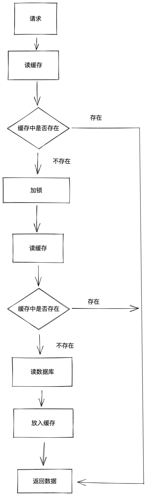
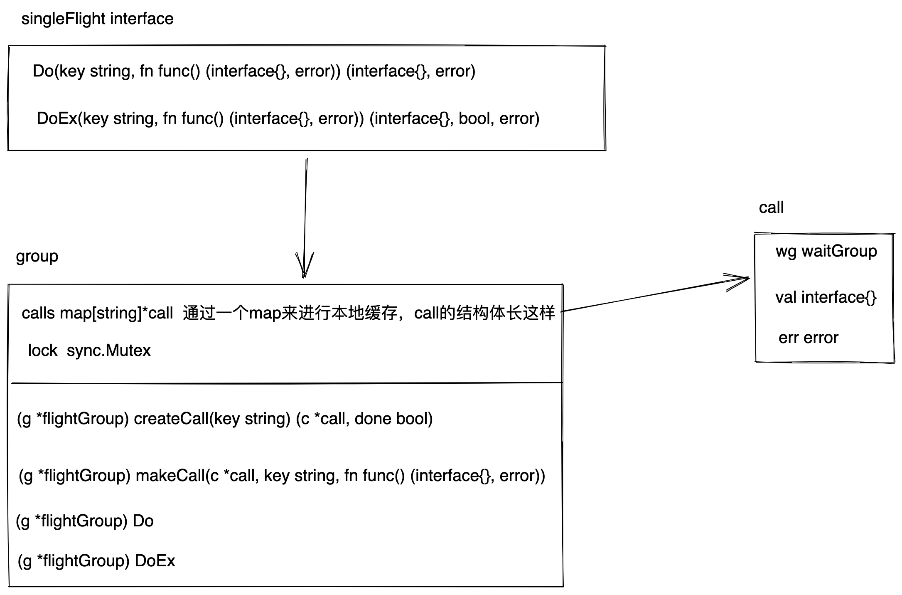
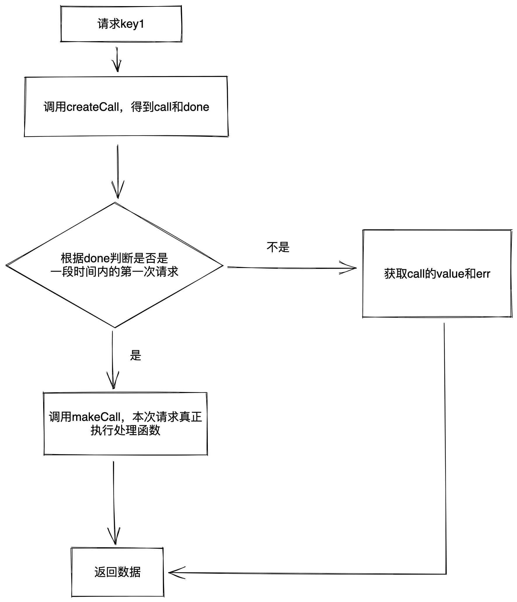

# 缓存常用模式

## cache-aside
cache-aside是我们最常见的缓存使用方式，使用流程是我们在程序中查询一个数据的时候，先查缓存，缓存有就直接返回，缓存没有就查一下数据库，将数据库中返回的数据加入到缓存中。

## read-through
read-through和cache-aside很像，区别在于我们只是从缓存中拿，而不需要管缓存未命中的时候从哪里取，这个由缓存进行控制。比如服务A调用缓存服务B，服务A只需要调用一个取数据的接口，不需要管数据是从哪来的。服务B内部有缓存，缓存命中直接返回给服务A，缓存未命中由服务B从数据库中拿，再放入缓存中。

## write-through
write-through模式中，写操作通过缓存来操作，缓存中将写数据库和写缓存放在一个事务中，两个必须同时成功才算写操作执行成功。

## write-behind
在write-behind模式中，将写数据库和写缓存分离，先进行缓存的更新，缓存更新完成后通过异步（消息队列、定时任务）的方式写数据库。

# 缓存击穿
缓存击穿的特征是大流量同时请求同一个数据。场景：某一个热点key，在缓存过期的一瞬间，同时有大量的请求打进来，由于此时缓存过期了，所以请求最终都会走到数据库，造成瞬时数据库请求量大、压力骤增，甚至可能打垮数据库。
## 加锁读数据库
在实例中维护一个互斥锁，在没有读到缓存的时候加锁。执行步骤如下
1. 读缓存，读到直接返回
2. 没有读到缓存，加锁
3. 再读一次缓存，读到返回
4. 第二次没读到，读数据库
5. 读到的数据写到缓存中，返回数据。


## 进程内共享调用
加锁读数据库在服务实例不多，请求量不是非常大，数据库压力不大时可以非常简单的解决缓存击穿问题，但是会导致同时进来的请求串行处理的问题。这个问题可以通过**进程内共享调用**来解决。
### 思想
进程内共享调用的思想其实本质上是利用内存缓存，在一段时间内到达的相同参数的请求，只真正处理一次，其他同时到达的请求复用这个真正处理的请求缓存的返回值。
### 实现
官方扩展包中有实现，[singleflight](https://github.com/golang/sync/blob/master/singleflight/singleflight.go)

go-zero中也有实现，[go-zero中的singleflight](https://github.com/zeromicro/go-zero/blob/a91c3907a8f68b6f08b1bad0125d7d5016105032/core/syncx/singleflight.go#L34)

### go-zero解析
go-zero中用了不到100行代码实现了这个功能。首先，go-zero中定义了SingleFlight接口，接口中有Do和DoEx两个方法，这两个方法区别在于DoEx多返回了一个bool返回值，标识这次函数调用是否是真正执行的那个。
```go 
SingleFlight interface {
	Do(key string, fn func() (interface{}, error)) (interface{}, error)
	DoEx(key string, fn func() (interface{}, error)) (interface{}, bool, error)
}
```
go-zero中有一个group结构体实现了singleFlight接口，这个结构体长这样
```go
type flightGroup struct {
	calls map[string]*call
	lock  sync.Mutex
}
func (g *flightGroup) Do(key string, fn func() (interface{}, error)) (interface{}, error) 
func (g *flightGroup) DoEx(key string, fn func() (interface{}, error)) (val interface{}, fresh bool, err error)
func (g *flightGroup) createCall(key string) (c *call, done bool) 
func (g *flightGroup) makeCall(c *call, key string, fn func() (interface{}, error))
```
这里面有个互斥锁，用于整个map的并发控制。calls就是用map做的一个本地缓存，key是请求的缓存key，call存储了真正执行函数之后得到的value和err，这个结构体长这样。
```go
type call struct {
	wg  sync.WaitGroup
	val interface{}
	err error
}
```
wg是用来阻塞和通知其他协程的，当第一次创建call的时候，wg会+1，然后执行真正的函数，函数执行将返回值赋值给call的val和err，然后执行wg.Done()。其他在函数执行期间进入的请求会从flightGroup的calls中拿到这个call，然后调用call中的wg的wait()等待这个真正执行的函数执行完成。当执行完成后，其他在函数执行期间进入的请求被唤醒，直接拿call的val和err返回即可，整个的关系如图。

Do方法和DoEx方法的区别在于，Do方法不会告诉你这个值是真正执行函数获得的还是从缓存里面获得的，而DoEx方法可以是有返回值标识这个信息的。
Do的执行流程如图

执行流程详解
1. 当提供了key和fn来执行Do方法时，首先会调用createCall方法，该方法会返回一个call和一个bool值标记是否是新建的call，如果call是从缓存中获取的，bool值就是false，如果是新建的就是true。
2. 根据这个bool判断是否是新建的，如果不是新建的是从calls缓存里面拿的，说明fn已经执行过了，直接用call的val和err返回数据即可。
3. 如果是新建的，那就需要真正去调用一次fn了，通过makeCall方法调用fn，执行完拿到val和err返回。
4. 最终返回数据。

这些方法的代码，可以看一下。
```go 
func (g *flightGroup) Do(key string, fn func() (interface{}, error)) (interface{}, error) {
	c, done := g.createCall(key)
	if done {
		return c.val, c.err
	}

	g.makeCall(c, key, fn)
	return c.val, c.err
}

func (g *flightGroup) DoEx(key string, fn func() (interface{}, error)) (val interface{}, fresh bool, err error) {
	c, done := g.createCall(key)
	if done {
		return c.val, false, c.err
	}

	g.makeCall(c, key, fn)
	return c.val, true, c.err
}

func (g *flightGroup) createCall(key string) (c *call, done bool) {
	g.lock.Lock()
	if c, ok := g.calls[key]; ok {
		g.lock.Unlock()
		c.wg.Wait()
		return c, true
	}

	c = new(call)
	c.wg.Add(1)
	g.calls[key] = c
	g.lock.Unlock()

	return c, false
}

func (g *flightGroup) makeCall(c *call, key string, fn func() (interface{}, error)) {
	defer func() {
		g.lock.Lock()
		delete(g.calls, key)
		g.lock.Unlock()
		c.wg.Done()
	}()

	c.val, c.err = fn()
}

```

# 缓存穿透
## 场景
查询一个不存在的数据，因为数据库中没有，不会写入缓存，直接返回给客户端，如果大量查询这个不存在的数据，就会增大数据库压力。
## 解决方案
首先要做好参数校验，把明显错误的查询请求直接挡掉。

常规解决方案是在查询到不存在的数据时，把该数据也存入缓存，给一个特定的主键，在查询缓存数据时，判断一下主键值是否为特定的数，如果是特定主键，就直接返回，不需要查询数据库。

这种解决方案是有缺点的，一直添加缓存会导致OOM。

还可以通过使用布隆过滤器，初始化全部数据量，如果布隆过滤器中不存在的话，就直接返回，不需要查询数据库


# 缓存雪崩
场景：同一时间缓存大面积失效，从缓存中无法查到数据，压力全部转到数据库，导致数据库挂了。
解决方案：过期时间不要设置相同时间，加一个随机值，避免集中过期。