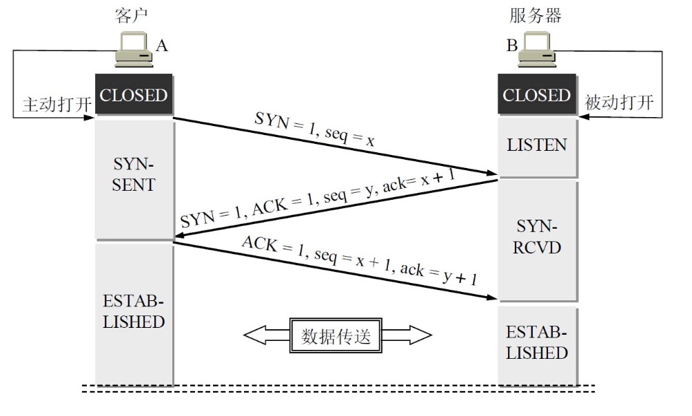
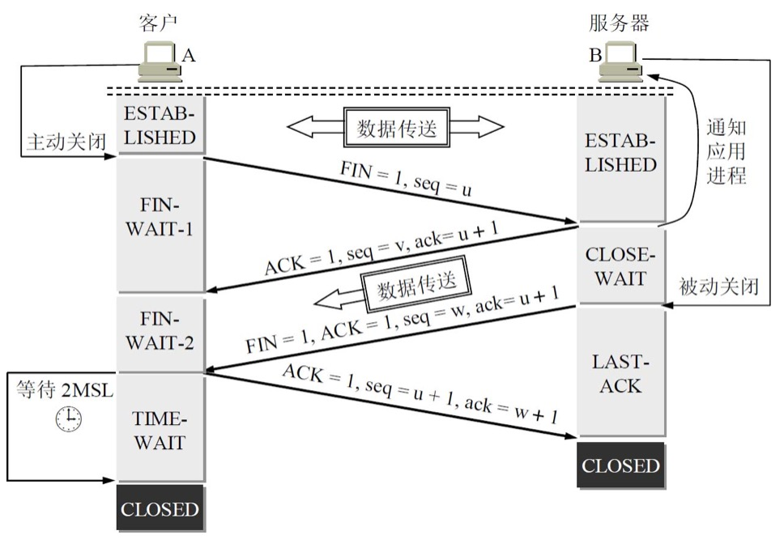

tcp是面向连接的传输层协议，提供可靠性保证，全双工通信，

# TCP首部
重点字段有
1. sourceIP，sourcePort，destinationIP,destinationPort
2. sequence 序号，发送方在这个报文段中第一个字节的序号，序号是循环用的用超了就循环到0也就是%2^32-1，为了解决带宽高导致的序号不够用又加了时间戳来解决循环序号问题。
3. ack 确认号，跟序号对应的，接收方下次希望收到的序号，这个序号前面的数据都被顺利接收了。
4. offset 用来标识真正的数据的偏移量
5. 控制位 
    * URG 标识需要紧急处理。
    * ACK 确认号是否有效，0无效1有效，握手时无效，建立完连接ACK都是1。
    * PSH 希望立即收到响应，很少用
    * SYN 握手的时候这个是1，标明是个请求建立连接的报文。请求建立连接SYN=1 ACK=0，接受建立连接请求SYN=1 ACK=1
    * FIN 要释放连接。
6. 窗口 标识我下次还能接受多少数据，2字节最大64K，未解决不够大的问题增加扩展字段，3个字节的窗口扩大选项，其中了1个字节表示移位多少，规定最大14，所以窗口最大为$2^(16+14)$。
7. 校验和 

# 可靠性
通过滑动窗口来控制数据的发送和淘汰，发送方维护发送窗口，接收方维护接收窗口，发送方发送窗口内的数据，发送完后等待ACK，接收方接收到数据后把数据投递给程序，然后返回数据的ACK，发送方如果长时间没有收到所发送数据的ACK就会重发这些数据。
## 超时时间
通过**往返时间RTT**计算出**平均往返时间RTTS**和**RTT的偏差的加权平均值RTTD**，再根据RTTS和RTTD计算出**超时时间RTO**，
$RTTS=0.875*oldRTTS+0.125*newRTT$

$RTTD=0.75*oldRTTD+0.25*|RTTS-newRTT|$

$RTO=RTTS+4*RTTD$

同时注意
1. 收到的ACK报文如果是重传的，就不采用这个样本的RTT，而是直接把RTO*2。

# 流量控制
通过窗口大小来进行流量控制，发送方接收方都会带自己目前还能接受的数据量，如果窗口到0了就表示不再接受数据了，一直到接收方重新发一个窗口不为0的报文到发送方为止，接收方返回的如果不是0就正常。为了防止接收方发送的窗口不为0的报文丢失导致的发送方一直不发数据，发送方也会维护一个探测计时器，到一定时间了发一个探测包到接收方，接收方再返回一个当前窗口值。

# 拥塞控制
发送方维护一个拥塞窗口cwnd来限制发送的速度，发送速度取min(cwnd,rwnd)
## 慢开始
发送方在开始的时候会使用慢开始算法，把拥塞窗口设置的小一些，一般2到4个**最大报文段SMSS**，在收到ack的时候拥塞窗口进行增长，增长速度相当于一个传输轮次扩大一倍。

## 拥塞避免
发送方维护拥塞窗口的拥塞窗口如果大于**慢开始门限ssthresh**就会开启拥塞避免算法，启动拥塞避免算法后拥塞窗口增长的速度就不会像慢开始算法一样指数增长而是改为线性增长，如果出现了超时设cwnd=1，ssthresh=cwnd/2，再次达到ssthresh时进入拥塞避免，当收到**快重传**的3个相同的ack时进行快恢复。

## 快重传
快重传是为了让发送方尽早知道报文段丢失，要求接收方立即发送确认，规定发送方收到连续三次相同seq的ack就会立即重传丢失的包。

## 快恢复
在收到快重传包的时候我们知道只是个别的包丢失了，立刻重传丢失的包然后启动快恢复算法，让cwnd大小快速恢复过来，这个算法是在将ssthresh值降低一倍后，设置cwnd=ssthresh，然后执行拥塞避免算法让cwnd线性增长。

## 总结
TCP通过慢开始，拥塞避免，快重传，快恢复四个算法实现了拥塞控制，建立连接首先进行慢启动，cwnd指数增长，达到阈值后进行拥塞避免，cwnd指数增长，当超时的时候cwnd降为初始值继续慢启动，同时阈值减为cwnd变化前的一半，当遇到同时收到三个相同ack，进入快重传立刻重传丢失的包，然后进入快恢复阈值降为cwnd的一半，同时cwnd也降为一半，进行拥塞避免线性增长cwnd。

### 其他
链路上的路由器等设备会维护一个队列，当队列长度达到一个阈值的时候会按照一定概率去随机丢弃分组，防止当这个路由器的处理能力成为瓶颈的时候同时丢弃一堆TCP连接的分组，这些TCP连接同时进入慢启动，浪费信道带宽。

# 连接管理

## 三握
基本流程如图所示

1. 首先A和B都是CLOSE状态，作为server的B启动服务开始LISTEN
2. A请求和B建立连接，SYN=1 seq=x，进入SYN-SEND状态
3. B接收到A的请求进行响应，SYN=1 ACK=1 seq=y ack=x+1，进入SYN-RCVD状态
4. A接收到B的响应，发送ACK=1 seq=x+1 ack=y+1，进入ESTABLISHED状态
5. B接收到A的ACK，进入ESTABLISHED状态

### 为啥是三握
从上面的过程看起来最后一次A给B发送的ACK其实是没啥用的，因为A在接受到B的响应之后其实B就已经可以做好准备直接进入ESTABLISH状态了，但想象这样一种场景A第一次发连接请求走得慢，但是A不知道是走得慢，这时候超时了A就又重新发了一遍，B先收到了重发的报文建立连接，又收到了过期的报文以为A重新建立了连接，进入了ESTABLISHED状态，这时就GG了，因为A收到了这个SYN ACK的时候发现是个错误的就丢弃了，也不会建立连接，但是B的连接已经建立了还等着A发消息呢，白白浪费了资源。所以为了避免这种情况，让A再回一个ACK之后再进入ESTABLISH状态，这个ACK上面可以带数据。

## 四挥
四挥过程如下图

1. A主动发起释放连接，FIN=1，从ESTABLISHED状态进入FIN-WAIT-1状态，等待B回复。
2. B收到了A的FIN=1，回复A ACK=1，进入CLOST-WAIT状态，继续发送数据，A收到了B的ACK=1，进入FIN-WAIT-2状态。
4. 待B发送完毕后，B对A发起FIN=1 ACK=1，进入LAST-ACK状态，等待A回复。
5. A对B的FIN=1 ACK=1进行回复，ACK=1，进入TIME-WAIT状态，等待**2MSL（2个最长报文段寿命）**后进入CLOSE状态。
6. B收到A的回复，进入CLOSE状态。

### 为啥是四挥

### 为啥要TIME-WAIT
1. 确保A发送的ACK到达B，如果B没有接到A的ACK，会重传FIN ACK。
2. 防止之前有相同四元组创建连接的请求还停留在链路中。

## 保活机制
服务器通过维护keepalive-timer定时器，在客户端2小时没有交互的情况下，每隔75s发送一次探测报文，连续10个报文客户端都没响应的话就关闭连接防止浪费资源。
# 问题
1. 每一个TCP连接都有一块缓存么？这个缓存一般是多大的？
